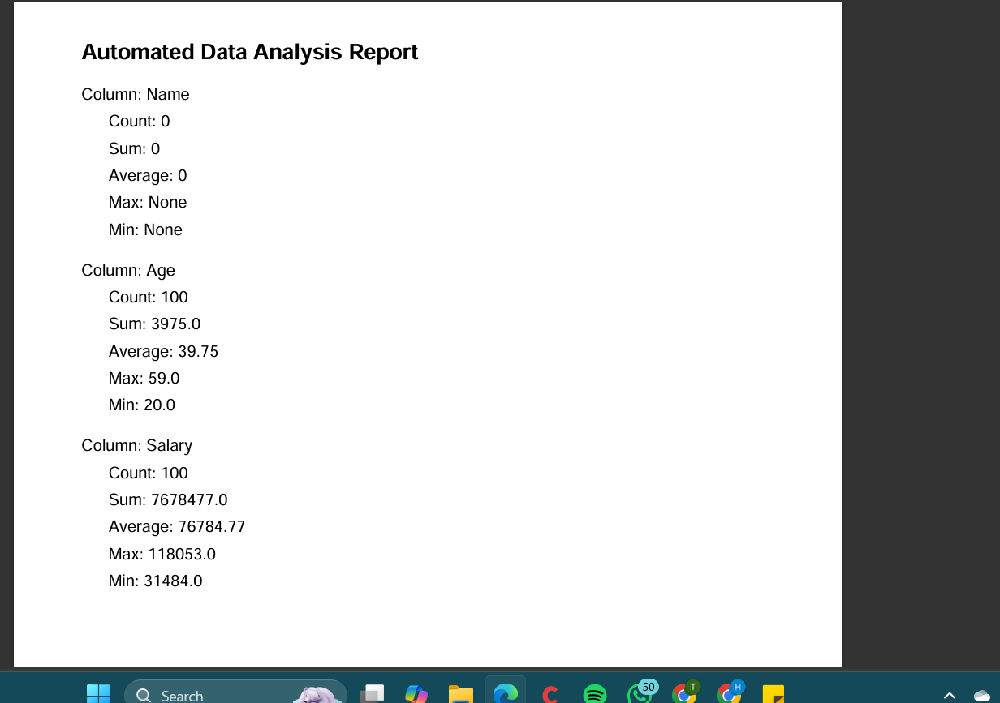

# Automated Report Generation
- **Name**: Shaik Burujula Jeevanbi
-
- **Company**: CODTECH IT SOLUTIONS
-  
- **ID**: CTO6DL935
-  
- **Domain**: PYTHON PROGRAMMING
-  
- **Duration**:may 5th,2025 to june 20th,2025[6 weeks]
- 
- **Mentor**:Neela Santhosh
---

## TASK - 1 - Automated Report Generation

### Objective
The objective of this task is to:
- Simplify data analysis by automating the report generation process.
- Provide a user-friendly way to summarize and visualize data insights.

---

### Key Activities
1. Reading data from a CSV file.
2. Analyzing numeric data to calculate:
   - Count
   - Sum
   - Average
   - Maximum
   - Minimum
3. Generating a PDF report with the summarized data.
4. Formatting the report for readability.

---

### Technologies Used
- **Python**: Core programming language.
- **Libraries**:
  - `csv`: For reading and processing data files.
  - `ReportLab`: For creating and designing PDF reports.

---

### Scope
- Automates repetitive tasks for data analysis.
- Useful for quick data insights without needing complex tools.
- Supports customizations to include more analytical features.

---

### Advantages
- Saves time and effort in manual reporting.
- Provides clear and concise insights in PDF format.
- Can be easily adapted for different datasets.

---

### Disadvantages
- Limited to numeric data analysis.
- Requires Python environment setup.
- Output format customization is minimal.

---

### Key Insights
- Automated tools reduce manual errors in data analysis.
- Libraries like ReportLab are powerful for creating professional reports.

---

### Future Improvements
- Add support for data visualization (charts and graphs).
- Include advanced statistical analysis.
- Enable real-time report generation via a web or GUI interface.

---

## Code Explanation
1. **Data Analysis**:
   - The `analyze_data` function reads data from a CSV file and computes statistics for numeric columns.
   
2. **PDF Report Generation**:
   - The `generate_pdf_report` function creates a PDF file using the analyzed data, formatting it with titles and column summaries.

3. **Main Function**:
   - Reads input data (`data.csv`), calls analysis and report generation functions, and saves the report as `report.pdf`.

---

## Output
This project is focused on creating an automated report generation script using Python. It reads data from a CSV file, performs basic data analysis, and generates a well-formatted PDF report using the **ReportLab** library. 

---

